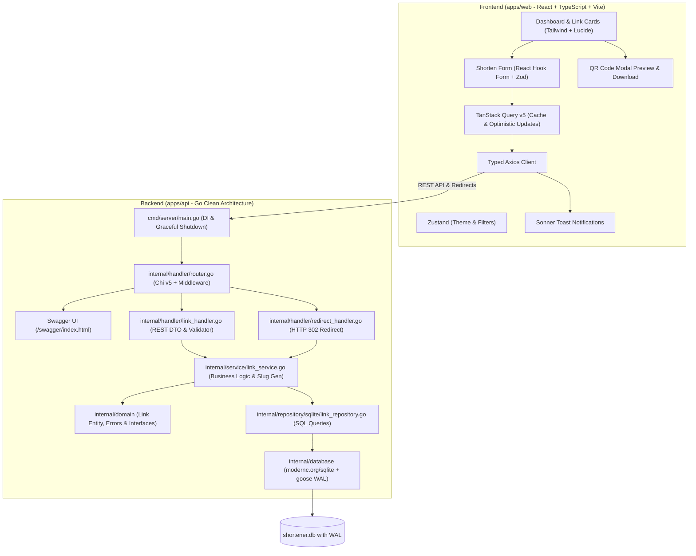

# 🚀 Avari URL Shortener Monorepo

## Agent development

Repository-specific agent instructions, skills, specialist roles and executable quality gates are included.
Start with `make context`, then `make check` (Python 3.11+, Go, Node.js and pnpm; install web dependencies in `apps/web` first).
Read the [harness guide in Russian](docs/harness.md) for workflows, token tradeoffs and usage examples.

[](https://github.com/OstKost/avari-links/actions)
[](https://go.dev)
[](https://react.dev)
[](https://www.typescriptlang.org)
[](https://sqlite.org)
[](https://tailwindcss.com)
[](https://opensource.org/licenses/MIT)

A modern, production-grade, highly scalable URL shortener and link analytics platform built as a clean **Monorepo** following **Clean Architecture (Onion/Hexagonal)** principles.

Designed as an exemplary portfolio project showcasing senior-level engineering standards, uncompromising code clarity, zero-CGO portability, and streamlined developer experience.

---

## 🏛️ System Architecture



---

## 🌟 Key Highlights & Design Decisions

### 1. Backend (Go)
- **Clean Architecture**: Domain isolation (`internal/domain`) has zero external dependencies. Business rules reside in `internal/service`, data persistence in `internal/repository/sqlite`, and HTTP layer in `internal/handler`.
- **Zero-CGO SQLite (`modernc.org/sqlite`)**: 100% pure Go implementation. Compiles to static portable binaries for any target OS without C compiler toolchains.
- **SQLite Concurrency & WAL**: Configured with `PRAGMA journal_mode=WAL;`, `PRAGMA busy_timeout=5000;`, and `PRAGMA foreign_keys=ON;` for lock-free parallel reads and safe concurrent writes.
- **Embedded Database Migrations**: Uses `pressly/goose/v3` with Go standard `embed.FS` to automatically apply migrations on startup.
- **Structured Logging**: Built-in `log/slog` JSON logger with HTTP request tracing and error diagnostics.
- **Interactive OpenAPI/Swagger**: Full Swagger UI embedded and served at `/swagger/index.html`.
- **Validation**: Strict DTO validation with `go-playground/validator/v10`.
- **Graceful Shutdown**: Context-aware termination on `SIGINT` / `SIGTERM`.

### 2. Frontend (React + TypeScript)
- **Feature-Driven Structure**: Modular codebase separated into `app`, `features`, `entities`, and `shared`.
- **Server State & Caching**: `@tanstack/react-query` v5 for query deduplication, background refetching, and optimistic updates.
- **Performant Form Validation**: `react-hook-form` paired with `zod` for strictly typed client-side schema validation.
- **Client State**: Lightweight `zustand` store for dark/light mode, view preferences, and search filters.
- **UI & UX**: Tailored Tailwind CSS, modern Lucide icons, accessible modals, and `sonner` toasts.
- **Built-in QR Code Generator**: Instant QR code preview with high-res PNG download.

---

## 📂 Repository Structure

```text
avari-links/
├── .github/
│   └── workflows/
│       └── ci.yml               # Automated CI (Test with race detector, lint, typecheck, build)
├── apps/
│   ├── api/                     # Go Backend
│   │   ├── cmd/
│   │   │   └── server/
│   │   │       └── main.go      # Composition Root, DI, Graceful Shutdown
│   │   ├── docs/                # Generated Swagger/OpenAPI documentation
│   │   ├── internal/
│   │   │   ├── config/          # Environment configuration (caarlos0/env)
│   │   │   ├── database/        # SQLite connection, WAL pragmas, goose migrations
│   │   │   │   └── migrations/  # Embedded SQL migrations
│   │   │   ├── domain/          # Pure Entities, Custom Errors, Repository/Service Interfaces
│   │   │   ├── handler/         # Chi HTTP handlers, REST DTOs, DTO validator
│   │   │   ├── middleware/      # Slog logger, CORS, RequestID, Recovery
│   │   │   ├── repository/      # SQLite repository implementation & integration tests
│   │   │   └── service/         # Business logic, Base62 slug generation, Unit tests
│   │   ├── pkg/
│   │   │   └── base62/          # Cryptographically secure Base62 random generator
│   │   ├── go.mod
│   │   ├── go.sum
│   │   ├── .golangci.yml        # Strict Go linter configuration
│   │   └── Dockerfile           # Multi-stage minimal Alpine image
│   │
│   └── web/                     # React Frontend
│       ├── src/
│       │   ├── app/             # Router, Navbar, Hero, Footer, Global providers
│       │   ├── entities/        # Link domain entities, API calls, TanStack Query hooks
│       │   ├── features/        # CreateLink (Zod form), LinkList (Cards/Table/Stats), QRModal
│       │   ├── shared/          # UI Kit (Button, Input, Card, Modal, Badge), hooks, Zustand store
│       │   ├── App.tsx
│       │   ├── main.tsx
│       │   └── index.css
│       ├── index.html
│       ├── package.json
│       ├── tsconfig.json
│       ├── vite.config.ts
│       ├── tailwind.config.js
│       ├── nginx.conf
│       └── Dockerfile           # Multi-stage Nginx container
│
├── deployments/
│   ├── docker-compose.yml       # Production-ready Compose with healthchecks & volumes
│   └── .env.example             # Environment template
│
├── Makefile                     # Unified project orchestration (dev, test, lint, build, swagger)
├── .gitignore
├── .editorconfig
└── README.md
```

---

## 📡 REST API Reference

| Method | Endpoint | Description |
|---|---|---|
| `POST` | `/api/v1/links` | Create a shortened URL with optional custom slug & title |
| `GET` | `/api/v1/links` | List shortened links (supports `search`, `limit`, `offset`) |
| `GET` | `/api/v1/links/{id}` | Get link details by UUID |
| `PATCH` | `/api/v1/links/{id}/status` | Toggle active status (`{ "is_active": false }`) |
| `DELETE` | `/api/v1/links/{id}` | Permanently delete link |
| `GET` | `/s/{code}` | **Public Short URL redirect** (HTTP 302 + click tracking) |
| `GET` | `/healthz` | Health check & SQLite connectivity status |
| `GET` | `/swagger/index.html` | Interactive Swagger / OpenAPI Documentation |

---

## ⚡ Quickstart Guide

### Prerequisites
- **Go** (1.22+)
- **Node.js** (20+) & **pnpm** (or npm)
- **Docker & Docker Compose** (optional, for containerized run)
- **Make**

### 1. Local Development (Hot Reload)
Run backend and frontend simultaneously with a single command:
```bash
make dev
```
- **Frontend Web**: [http://localhost:4810](http://localhost:4810)
- **Backend API**: [http://localhost:4820](http://localhost:4820)
- **Swagger UI**: [http://localhost:4820/swagger/index.html](http://localhost:4820/swagger/index.html)

### 2. Run via Docker Compose
```bash
make docker-up
```
- **Frontend Web**: [http://localhost:4800](http://localhost:4800)
- **Backend API**: [http://localhost:4820](http://localhost:4820)
- **Swagger UI**: [http://localhost:4820/swagger/index.html](http://localhost:4820/swagger/index.html)

To stop:
```bash
make docker-down
```

---

## 🧪 Testing & Verification

```bash
# Run all tests (API & Web)
make test

# Run Go unit & integration tests with race detector
make test-api

# Run TypeScript check & bundle build
make test-web

# Run full project linters
make lint

# Compile production binaries
make build
```

---

## 📄 License
This project is licensed under the [MIT License](LICENSE).
