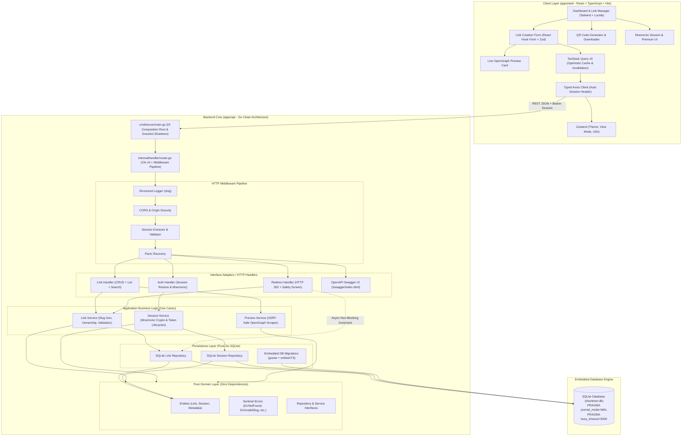
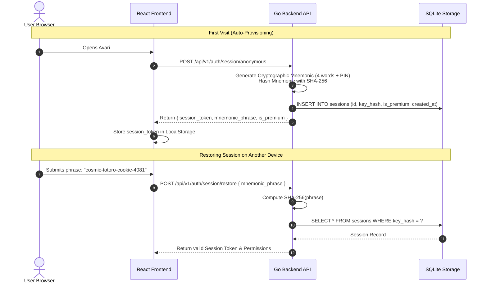

# 🌌 Avari Links — Modern URL Shortener & Link Analytics Platform

<div align="center">


<p align="center">
  <strong>Production-grade, privacy-first URL shortener, real-time link analytics, and link safety platform.</strong><br>
  Built with <strong>Go Clean Architecture</strong> (Zero-CGO Pure Go + SQLite WAL) and a <strong>React 18 + TypeScript</strong> frontend.
</p>

[](https://github.com/OstKost/avari-links/actions)
[](https://go.dev)
[](https://react.dev)
[](https://www.typescriptlang.org)
[](https://sqlite.org)
[](https://tailwindcss.com)
[](https://www.docker.com/)
[](https://opensource.org/licenses/MIT)

[Features](#-key-features) • [Architecture](#-system-architecture) • [Engineering Deep Dive](#-engineering-deep-dive) • [API Reference](#-rest-api-reference) • [CLI & Operations](#-administration--cli-toolkit) • [Quickstart](#-quickstart-guide) • [Testing](#-testing--quality-gates)

</div>

---

## 🌟 Key Features

### ⚡ Core Link Shortening & Management
- **Instant Base62 Slug Generation**: Cryptographically secure, collision-resistant slug generation (`[a-zA-Z0-9]`).
- **Custom Slugs & Aliases**: Support for branded vanity URLs (e.g. `/s/my-portfolio`).
- **Live OpenGraph Metadata Scraper**: Real-time URL preview card fetching target site's title, description, favicon, and social image previews with SSRF safeguards.
- **QR Code Engine**: In-browser vector QR generation with one-click high-resolution PNG download.
- **Dual Dashboard Modes**: Toggle seamlessly between responsive **Card Grid View** and structured **Data Table View** with sorting, search, and pagination.
- **Status Lifecycle & Deletion**: Enable/disable links without deleting them, or permanently prune expired entries.

### 🔐 Privacy-First Anonymous Sessions & Mnemonic Keys
- **No Password / No Email Required**: Zero friction onboarding. Users receive an ephemeral anonymous session automatically.
- **Mnemonic Key Recovery**: Every anonymous session is tied to a secure 4-word mnemonic passphrase (e.g., `cosmic-totoro-cookie-4081`).
- **Session Migration**: Export or enter your mnemonic passphrase on any device to instantly restore and manage your shortened links.
- **Cryptographic Isolation**: Keys are stored as salted SHA-256 hashes in SQLite; raw passphrases are never persisted on the server.

### 🛡️ Built-in Content Moderation & Safety Shield
- **Safety Interception Screen**: Interstitial safety warning for links flagged with sensitive, adult, or suspicious domains.
- **Explicit Consent Bypass**: Protects visitors by displaying destination previews and requiring user confirmation before redirecting to flagged URLs.

### ⭐ ★ PREMIUM Tier System
- **Ultra-Short Slugs**: Premium accounts unlock 4-character vanity slugs (standard tier requires 6+ characters).
- **Extended TTL & Immunity**: Exemption from inactive link cleanup routines and 2-year data retention.
- **Tier Badging**: Visual golden star badge and exclusive privileges throughout the dashboard.

### 🎨 Modern UX & Polish
- **Cosmic Dark & Light Themes**: Atmospheric nebula theme with floating particle firefly animations.
- **Dual Language i18n**: Instant Russian & English localization toggle.
- **Toast Notifications**: Interactive feedback with Sonner.
- **Accessibility & Responsiveness**: Fully responsive across mobile, tablet, and widescreen layouts with WCAG-compliant contrasts.

---

## 🏛️ System Architecture

Avari is built as a high-performance **Monorepo** following **Clean Architecture (Hexagonal / Ports & Adapters)** principles.



---

## 🔬 Engineering Deep Dive

### 1. Zero-CGO Pure Go SQLite (`modernc.org/sqlite`)
- **Portability**: Most Go SQLite drivers rely on `mattn/go-sqlite3` which requires `CGO_ENABLED=1` and a GCC toolchain. Avari uses `modernc.org/sqlite` (pure Go translated from SQLite C source).
- **Cross-Compilation**: Easily cross-compiles to Linux, macOS, and Windows into a single lightweight static binary.
- **Concurrency & WAL Mode**:
  ```sql
  PRAGMA journal_mode=WAL;
  PRAGMA busy_timeout=5000;
  PRAGMA synchronous=NORMAL;
  PRAGMA foreign_keys=ON;
  ```
  WAL (Write-Ahead Logging) allows concurrent readers to operate without blocking writers, delivering high throughput under heavy redirect traffic.

### 2. Anonymous Mnemonic Session Authentication Flow



### 3. Real-Time OpenGraph Scraper Pipeline
When a user pastes a target URL into the creation form:
1. **Debounced Request**: Frontend debounces input (400ms) and calls `/api/v1/links/preview?url=...`.
2. **SSRF Guard**: The backend validates the host, disallowing localhost, `127.0.0.1`, `10.0.0.0/8`, `192.168.0.0/16`, `169.254.0.0/16`, and AWS metadata endpoints.
3. **HTTP Streaming Parser**: Fetches only the first 64KB with a 3-second timeout and parses `<meta property="og:title">`, `<meta property="og:description">`, `<meta property="og:image">`, and `<link rel="icon">`.
4. **Live Card Rendering**: The UI renders a rich preview card with responsive image fallback.

### 4. Non-Blocking Fast Redirect & Click Tracking
- High redirect speed is guaranteed: `/s/{code}` queries the database, checks active status, and immediately returns an HTTP `302 Found` with the `Location` header.
- The click count increment runs in a lightweight asynchronous goroutine or deferred task without delaying the user's redirect latency.

---

## 📂 Repository Layout

```text
avari-links/
├── .github/
│   └── workflows/
│       ├── ci.yml                 # Automated quality gates (Go Race, Lint, Web Build & Tests)
│       └── release.yml            # Release packaging and binary distributions
│
├── apps/
│   ├── api/                       # Go Clean Architecture Backend
│   │   ├── cmd/server/main.go     # Application composition root & DI
│   │   ├── docs/                  # Swagger / OpenAPI 2.0 specifications
│   │   ├── internal/
│   │   │   ├── config/            # Strongly-typed env configuration (caarlos0/env)
│   │   │   ├── database/          # SQLite driver, pragmas & goose embedded migrations
│   │   │   │   └── migrations/    # SQL schema migrations (00001 to 00004)
│   │   │   ├── domain/            # Pure Entities (Link, Session), Sentinel Errors & Contracts
│   │   │   ├── handler/           # Chi HTTP Handlers (Link, Auth, Redirect, Swagger)
│   │   │   ├── middleware/        # Slog logger, CORS, Session Context, Panic Recovery
│   │   │   ├── repository/sqlite/ # SQL data access implementations & integration tests
│   │   │   └── service/           # Business logic (Slug Base62, Preview scraper, Sessions)
│   │   ├── pkg/
│   │   │   ├── base62/            # Secure Base62 slug generator
│   │   │   └── memkey/            # Mnemonic wordlist & passphrase generator
│   │   ├── Dockerfile             # Multi-stage minimal static Alpine/Scratch image
│   │   └── go.mod
│   │
│   └── web/                       # React 18 + TypeScript + Vite Frontend
│       ├── src/
│       │   ├── app/               # Navbar, HeroBanner, Footer, App Root
│       │   ├── entities/          # Link & Session domains, API adapters, TanStack queries
│       │   ├── features/          # CreateLink (Form + Preview), LinkList (Cards/Table/Stats),
│       │   │                      # QRCodeModal, SessionModal (Mnemonic backup & restore)
│       │   ├── shared/            # Reusable UI Kit (Button, Input, Badge, Modal, Switch, Avatar),
│       │   │                      # i18n dictionaries (EN/RU), Zustand store, Axios client
│       │   ├── App.tsx            # Root composition & layout
│       │   └── index.css          # Tailwind CSS custom themes & animations
│       ├── Dockerfile             # Multi-stage Nginx container
│       ├── package.json
│       └── vite.config.ts
│
├── deployments/
│   ├── docker-compose.yml         # Production multi-service orchestration
│   └── .env.example               # Environment variables template
│
├── docs/                          # Architecture guides, ADRs, tasks & admin runbooks
│   ├── administration.md          # SQLite operations & session management guide
│   ├── architecture.md            # In-depth architectural blueprint
│   └── harness.md                 # Agent and developer workflow guide
│
├── scripts/
│   ├── admin.sh                   # Administrative CLI tool for managing sessions & tiers
│   └── harness.py                 # Multi-tool automated check runner
│
├── Makefile                       # Unified developer tooling & quality gates
└── README.md
```

---

## 📡 REST API Reference

| Method | Endpoint | Auth | Description |
|---|---|:---:|---|
| `POST` | `/api/v1/links` | Optional | Create shortened link (custom slug, title, auto-detect preview) |
| `GET` | `/api/v1/links` | Session | List links owned by current session (`search`, `limit`, `offset`) |
| `GET` | `/api/v1/links/{id}` | Session | Retrieve detailed link metadata & analytics |
| `PATCH` | `/api/v1/links/{id}/status` | Session | Toggle active state (`{"is_active": true/false}`) |
| `DELETE` | `/api/v1/links/{id}` | Session | Permanently delete link |
| `GET` | `/api/v1/links/preview` | Public | Live OpenGraph metadata scrape (`?url=https://...`) |
| `POST` | `/api/v1/auth/session/anonymous`| Public | Provision new anonymous session & mnemonic key |
| `POST` | `/api/v1/auth/session/restore` | Public | Restore session via mnemonic phrase |
| `GET` | `/api/v1/auth/session/me` | Session | Get current session details & ★ Premium status |
| `GET` | `/s/{code}` | Public | **Public 302 Redirect** (with safety filter interception) |
| `GET` | `/healthz` | Public | Healthcheck and SQLite connection liveness |
| `GET` | `/swagger/index.html` | Public | Interactive Swagger / OpenAPI Documentation UI |

---

## 🛠️ Administration & CLI Toolkit

A dedicated administrative shell tool [`scripts/admin.sh`](scripts/admin.sh) is included for DevOps and site administrators:

```bash
# Display aggregate statistics (total sessions, active links, premium accounts)
./scripts/admin.sh stats

# List recent sessions with link counts and status
./scripts/admin.sh list

# Look up a session by mnemonic phrase or UUID
./scripts/admin.sh find cosmic-totoro-cookie-4081

# Upgrade a user to ★ PREMIUM tier (enables 4-char slugs & long retention)
./scripts/admin.sh set-premium cosmic-totoro-cookie-4081

# Revoke premium status
./scripts/admin.sh revoke-premium cosmic-totoro-cookie-4081
```

> 📖 Detailed SQL queries, WAL backup strategies, and maintenance tasks are documented in [`docs/administration.md`](docs/administration.md).

---

## ⚡ Quickstart Guide

### Prerequisites
- **Go 1.22+**
- **Node.js 20+** and **pnpm** (or npm)
- **Docker & Docker Compose** (optional)
- **Make**

### 1. Local Development (Single Command)
Run both backend and frontend with live hot-reloading:
```bash
make dev
```
- **Web App**: [http://localhost:4810](http://localhost:4810)
- **API Server**: [http://localhost:4820](http://localhost:4820)
- **Interactive Swagger UI**: [http://localhost:4820/swagger/index.html](http://localhost:4820/swagger/index.html)

### 2. Docker Compose Deployment
Launch the complete containerized stack in isolated production mode:
```bash
make docker-up
```
To stop the stack:
```bash
make docker-down
```

---

## 🧪 Testing & Quality Gates

The codebase adheres to rigorous testing standards across all tiers:

```bash
# Run full verification suite (Go race detector, vet, format, TS typecheck, lint, web tests, build)
make check

# Run Go unit and integration tests with data race detector
make test-api

# Run Frontend Vitest unit and component tests
make test-web

# Execute Go and ESLint linters
make lint

# Compile production-ready binaries and assets
make build
```

---

## 📄 License
This project is open-source software licensed under the [MIT License](LICENSE).
