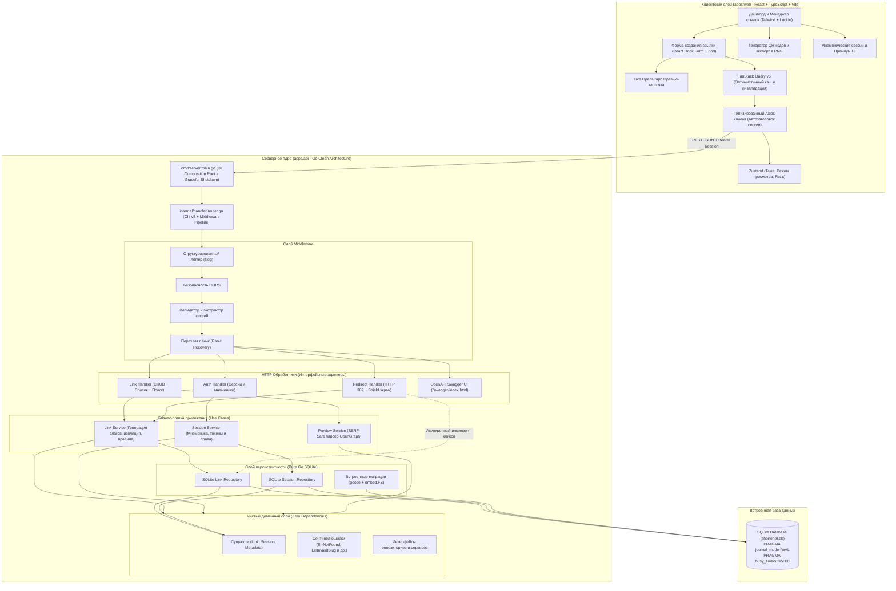
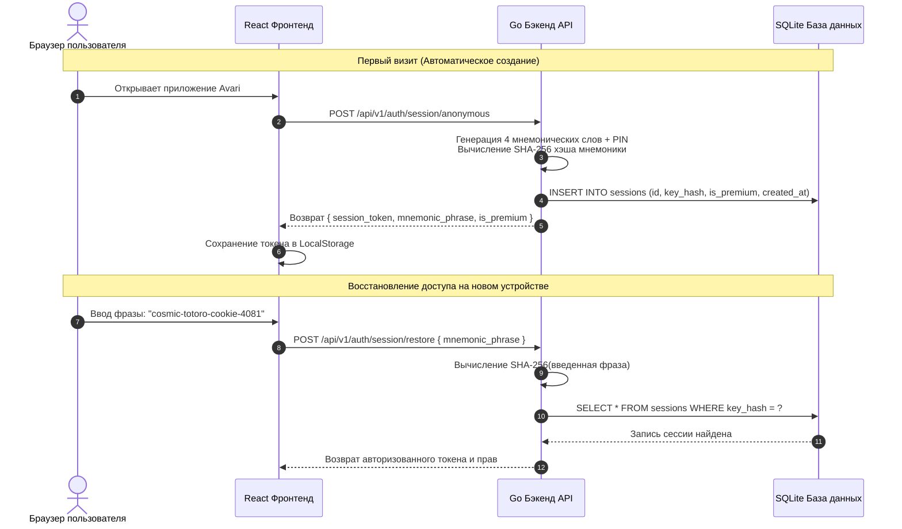

# 🌌 Avari Links — Платформа сокращения ссылок и аналитики

<div align="center">


<p align="center">
  <strong>Production-ready, приватный сервис сокращения ссылок, аналитики переходов в реальном времени и фильтрации угроз.</strong><br>
  Построен на базе <strong>Go Clean Architecture</strong> (Zero-CGO Pure Go + SQLite WAL) и современного фронтенда на <strong>React 18 + TypeScript</strong>.
</p>

[](README.md)
[](README_RU.md)
[](https://github.com/OstKost/avari-links/actions)
[](https://go.dev)
[](https://react.dev)
[](https://www.typescriptlang.org)
[](https://sqlite.org)
[](https://tailwindcss.com)
[](https://www.docker.com/)
[](LICENSE)

[Возможности](#-ключевые-возможности) • [Архитектура](#-архитектура-системы) • [Инженерный разбор](#-инженерный-разбор-deep-dive) • [API Спецификация](#-справочник-rest-api) • [CLI и Администрирование](#-администрирование-и-cli) • [Быстрый старт](#-быстрый-старт) • [Тестирование](#-тестирование-и-контроль-качества)

</div>

---

## 🌟 Ключевые возможности

### ⚡ Сокращение ссылок и управление
- **Мгновенная генерация Base62 слагов**: Криптографически стойкий алгоритм генерации коротких идентификаторов (`[a-zA-Z0-9]`) с защитой от коллизий.
- **Кастомные алиасы (Custom Slugs)**: Поддержка брендированных коротких URL (например, `/s/my-portfolio`).
- **Живой скрейпер OpenGraph метаданных**: Превью-карточка ссылки в реальном времени (название, описание, фавиконка и превью-картинка целевого сайта) со встроенной защитой от SSRF.
- **Встроенный генератор QR-кодов**: Векторная генерация QR-кода прямо в браузере с возможностью скачивания в высоком разрешении PNG в один клик.
- **Два режима дашборда**: Быстрое переключение между адаптивной **сеткой карточек** и структурированной **таблицей данных** с поиском, фильтрами и пагинацией.
- **Управление жизненным циклом**: Временное отключение ссылок без удаления или их перманентная очистка.

### 🔐 Приватные анонимные сессии и мнемонические фразы
- **Без паролей и почты**: Полное отсутствие трения при входе. Пользователь сразу получает рабочую сессию.
- **Восстановление через мнемонику**: Каждая сессия привязана к секретной фразе из 4 слов и PIN (например, `cosmic-totoro-cookie-4081`).
- **Синхронизация между устройствами**: Достаточно ввести свою мнемоническую фразу на новом устройстве, чтобы получить доступ к своим ссылкам.
- **Криптографическая изоляция**: На сервере сохраняются только хэши SHA-256 с солью; исходные фразы никогда не попадают в базу данных.

### 🛡️ Модерация и экран безопасности (Shield)
- **Защита от небезопасного контента**: Интерстициальный экран предупреждения для ссылок с подозрительных или NSFW/Adult доменов.
- **Осознанный переход**: Защищает пользователя, отображая предпросмотр целевого адреса и требуя подтверждения перед редиректом.

### ⭐ ★ PREMIUM Статус
- **Ультракороткие слаги**: Премиум-аккаунты могут задавать кастомные слаги от 4 символов (в стандартном тарифе от 6 символов).
- **Продленный срок хранения**: Иммунитет к фоновой очистке неактивных ссылок и 2 года хранения данных.
- **Эксклюзивный бейдж**: Золотая звезда и выделенный статус в интерфейсе.

### 🎨 Премиальный UX и дизайн
- **Космическая темная и светлая темы**: Глубокая неоново-туманная палитра с анимированными частицами-светлячками.
- **Мультиязычность (RU / EN)**: Мгновенное переключение языка интерфейса.
- **Интерактивные тосты**: Плавные уведомления на Sonner.
- **Доступность**: Адаптивный интерфейс для смартфонов, планшетов и десктопов с контрастностью по стандартам WCAG.

---

## 🏛️ Архитектура системы

Проект организован как модульный **Monorepo**, строго следующий принципам **Чистой Архитектуры (Clean Architecture / Ports & Adapters)**.



---

## 🔬 Инженерный разбор (Deep Dive)

### 1. Zero-CGO Чистый Go SQLite (`modernc.org/sqlite`)
- **Портативность**: Большинство Go-драйверов используют `mattn/go-sqlite3`, требующий включенного CGO (`CGO_ENABLED=1`) и установленного компилятора GCC. В Avari применен драйвер `modernc.org/sqlite` (транслированный C-код SQLite в 100% чистый Go).
- **Кросс-компиляция**: Легко собирается под Linux, macOS и Windows в единый статический бинарник без внешних runtime-зависимостей.
- **Конкурентность и WAL-режим**:
  ```sql
  PRAGMA journal_mode=WAL;
  PRAGMA busy_timeout=5000;
  PRAGMA synchronous=NORMAL;
  PRAGMA foreign_keys=ON;
  ```
  Режим WAL (Write-Ahead Logging) позволяет сотням параллельных читателей выполнять переходы по ссылкам, не блокируя фоновые операции записи.

### 2. Схема авторизации через мнемонические ключи



### 3. Парсер OpenGraph и защита от SSRF
При вводе URL в форму создания:
1. **Дебаунс**: Фронтенд выдерживает паузу в 400 мс перед отправкой запроса на `/api/v1/links/preview?url=...`.
2. **SSRF-фильтр**: Сервер проверяет IP адрес хоста и блокирует приватные диапазоны (`127.0.0.1`, `10.0.0.0/8`, `192.168.0.0/16`, `169.254.0.0/16`, AWS метаданные).
3. **Потоковый HTTP-парсер**: Загружает только первые 64 КБ страницы с таймаутом 3 секунды и извлекает метатеги `og:title`, `og:description`, `og:image` и фавиконку.
4. **Рендеринг карточки**: Пользователь сразу видит, как его ссылка будет отображаться в соцсетях и мессенджерах.

### 4. Неблокирующий редирект и аналитика
- Маршрут `/s/{code}` возвращает HTTP `302 Found` с минимально возможной задержкой.
- Увеличение счетчика кликов выполняется асинхронно в легковесной горутине, исключая задержки для пользователя при редиректе.

---

## 📂 Структура репозитория

```text
avari-links/
├── .github/
│   └── workflows/
│       ├── ci.yml                 # Автоматический CI (Go Race, линтеры, тесты Web и сборка)
│       └── release.yml            # Публикация релизов и кросс-платформенных бинарников
│
├── apps/
│   ├── api/                       # Go Clean Architecture Backend
│   │   ├── cmd/server/main.go     # Точка входа, DI и Graceful Shutdown
│   │   ├── docs/                  # Сгенерированная OpenAPI/Swagger документация
│   │   ├── internal/
│   │   │   ├── config/            # Строго типизированная конфигурация (caarlos0/env)
│   │   │   ├── database/          # SQLite драйвер, PRAGMA настройки и миграции goose
│   │   │   │   └── migrations/    # SQL миграции схемы (00001 - 00004)
│   │   │   ├── domain/            # Чистые сущности (Link, Session), сентинел-ошибки
│   │   │   ├── handler/           # HTTP обработчики Chi (Link, Auth, Redirect, Swagger)
│   │   │   ├── middleware/        # Логгер slog, CORS, контекст сессий, Panic Recovery
│   │   │   ├── repository/sqlite/ # Реализация доступа к SQLite и интеграционные тесты
│   │   │   └── service/           # Бизнес-логика (генератор слагов, парсер превью, сессии)
│   │   ├── pkg/
│   │   │   ├── base62/            # Криптостойкий Base62 генератор
│   │   │   └── memkey/            # Генератор мнемонических фраз и слов
│   │   ├── Dockerfile             # Минималистичный multi-stage Alpine/Scratch образ
│   │   └── go.mod
│   │
│   └── web/                       # Фронтенд на React 18 + TypeScript + Vite
│       ├── src/
│       │   ├── app/               # Навбар, Хиро-баннер, Футер, корень приложения
│       │   ├── entities/          # Доменные модели Link и Session, TanStack Query хуки
│       │   ├── features/          # CreateLink (форма + превью), LinkList (карточки/таблица),
│       │   │                      # QRCodeModal, SessionModal (бэкап и восстановление)
│       │   ├── shared/            # UI Kit (кнопки, инпуты, бейджи, модалки, свитчи),
│       │   │                      # словари переводов (RU/EN), Zustand стор, Axios клиент
│       │   ├── App.tsx            # Корневой компонент
│       │   └── index.css          # Tailwind CSS стили и анимации
│       ├── Dockerfile             # Multi-stage Nginx образ
│       ├── package.json
│       └── vite.config.ts
│
├── deployments/
│   ├── docker-compose.yml         # Production docker-compose с healthcheck и volume
│   └── .env.example               # Шаблон переменных окружения
│
├── docs/                          # Архитектура, ADR, задачи и руководства
│   ├── administration.md          # Руководство по SQLite и администрированию сессий
│   ├── architecture.md            # Детальный архитектурный план
│   └── harness.md                 # Руководство по процессам разработки и качеству
│
├── scripts/
│   ├── admin.sh                   # CLI утилита для управления сессиями и тарифами
│   └── harness.py                 # Автоматизированный раннер проверок
│
├── Makefile                       # Единая точка оркестрации команд
├── README.md                      # Документация на английском
└── README_RU.md                   # Документация на русском
```

---

## 📡 Справочник REST API

| Метод | Эндпоинт | Авторизация | Описание |
|---|---|:---:|---|
| `POST` | `/api/v1/links` | Опционально | Создать короткую ссылку (кастомный слаг, заголовок, превью) |
| `GET` | `/api/v1/links` | Сессия | Список ссылок текущей сессии (`search`, `limit`, `offset`) |
| `GET` | `/api/v1/links/{id}` | Сессия | Получить детальную информацию и статистику кликов |
| `PATCH` | `/api/v1/links/{id}/status` | Сессия | Переключить статус (`{"is_active": true/false}`) |
| `DELETE` | `/api/v1/links/{id}` | Сессия | Безвозвратно удалить ссылку |
| `GET` | `/api/v1/links/preview` | Публичный | Получение метаданных OpenGraph (`?url=https://...`) |
| `POST` | `/api/v1/auth/session/anonymous`| Публичный | Создать новую анонимную сессию и мнемонический ключ |
| `POST` | `/api/v1/auth/session/restore` | Публичный | Восстановить сессию по мнемонической фразе |
| `GET` | `/api/v1/auth/session/me` | Сессия | Проверить статус текущей сессии и наличие ★ Premium |
| `GET` | `/s/{code}` | Публичный | **Публичный редирект 302** (со встроенным экраном безопасности) |
| `GET` | `/healthz` | Публичный | Проверка работоспособности сервиса и подключения к БД |
| `GET` | `/swagger/index.html` | Публичный | Интерактивная документация Swagger / OpenAPI UI |

---

## 🛠️ Администрирование и CLI

В репозиторий включен удобный скрипт [`scripts/admin.sh`](scripts/admin.sh) для управления пользователями и мониторинга:

```bash
# Общая статистика сервиса (всего сессий, активных ссылок, премиум-аккаунтов)
./scripts/admin.sh stats

# Список последних сессий и количество ссылок
./scripts/admin.sh list

# Поиск сессии по мнемонической фразе или UUID
./scripts/admin.sh find cosmic-totoro-cookie-4081

# Выдача статуса ★ PREMIUM (разблокирует 4-значные слаги и вечное хранение)
./scripts/admin.sh set-premium cosmic-totoro-cookie-4081

# Отзыв премиум-статуса
./scripts/admin.sh revoke-premium cosmic-totoro-cookie-4081
```

> 📖 Прямые SQL-запросы и стратегия резервного копирования WAL описаны в [`docs/administration.md`](docs/administration.md).

---

## ⚡ Быстрый старт

### Требования
- **Go 1.22+**
- **Node.js 20+** и **pnpm** (или npm)
- **Docker & Docker Compose** (по желанию)
- **Make**

### 1. Локальная разработка (Одна команда)
Запуск бэкенда и фронтенда в режиме горячей перезагрузки (Hot Reload):
```bash
make dev
```
- **Фронтенд**: [http://localhost:4810](http://localhost:4810)
- **API сервер**: [http://localhost:4820](http://localhost:4820)
- **Swagger UI**: [http://localhost:4820/swagger/index.html](http://localhost:4820/swagger/index.html)

### 2. Запуск в Docker Compose
Запуск полного стека в изолированном production-контейнере:
```bash
make docker-up
```
Для остановки:
```bash
make docker-down
```

---

## 🧪 Тестирование и контроль качества

Проект покрыт полным набором автоматизированных тестов:

```bash
# Полный цикл верификации (Go race detector, vet, format, TS typecheck, lint, web tests, build)
make check

# Юнит и интеграционные тесты Go с детектором гонок (race detector)
make test-api

# Компонентные и юнит тесты фронтенда на Vitest
make test-web

# Запуск линтеров Go и ESLint
make lint

# Сборка продакшн бинарников и статики
make build
```

---

## 📄 Лицензия
Проект распространяется под открытой лицензией [MIT](LICENSE).
